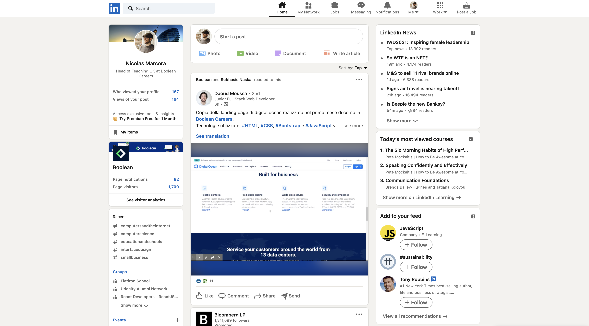
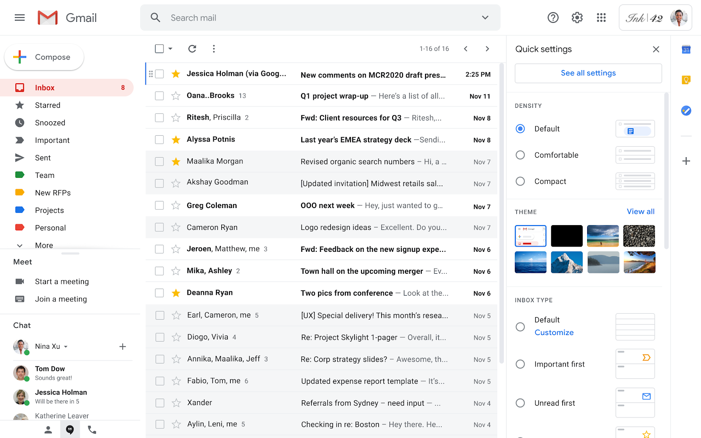
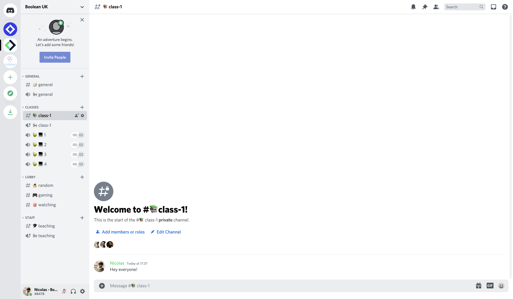

# Popular Page Layouts
In this exercise we will get some CSS Grid practice building the layouts of some of the most popular sites on the web
It's not just a good way to practice coding, but it will also give a perspective on how these sites are designed!

## Instructions
Replicate the high-level layout blocks of LinkedIn, Gmail, and Discord. Use the images below as a reference.  Create a different HTML file for each one of them, named after the layout you're creating and with its respective CSS sheet

### LinkedIn

### Gmail

### Discord

## Tips
- Focus on the bigger blocks that make up the site, don't get mixed up with the smaller details like cards and widgets
- User background colours to easily tell the blocks apart
- Remember to commit often, **especially before attempting the challenges!**

## Challenge 1
- Make them responsive! You can refer to their live version to check out how they change when shrinking.

## Challenge 2
- Try to recreate as much as you can of the inner layout of Gmail. Try to figure out how to use a grid to recreate the list of items and their inner layout.